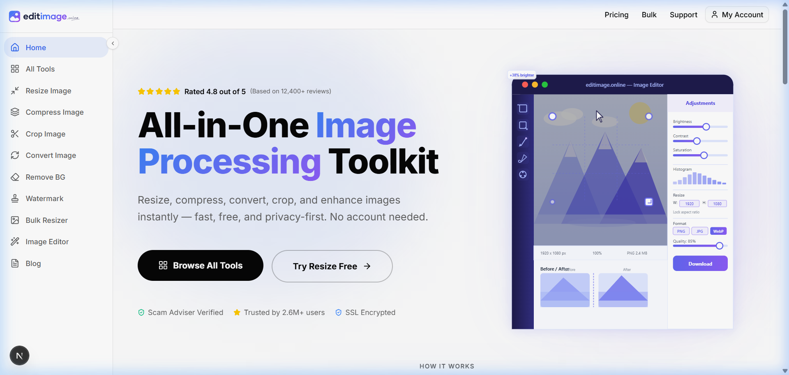
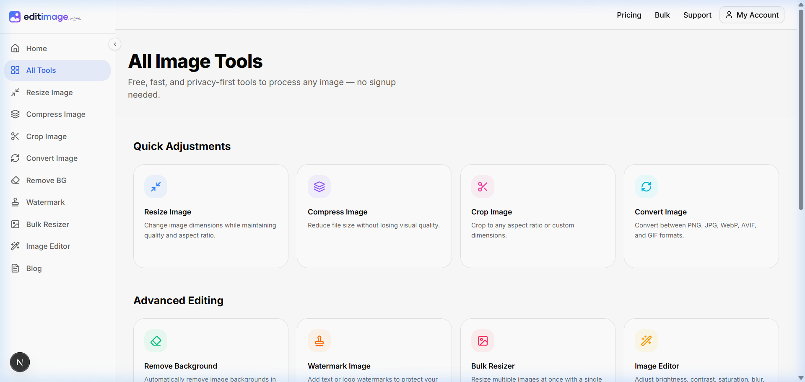
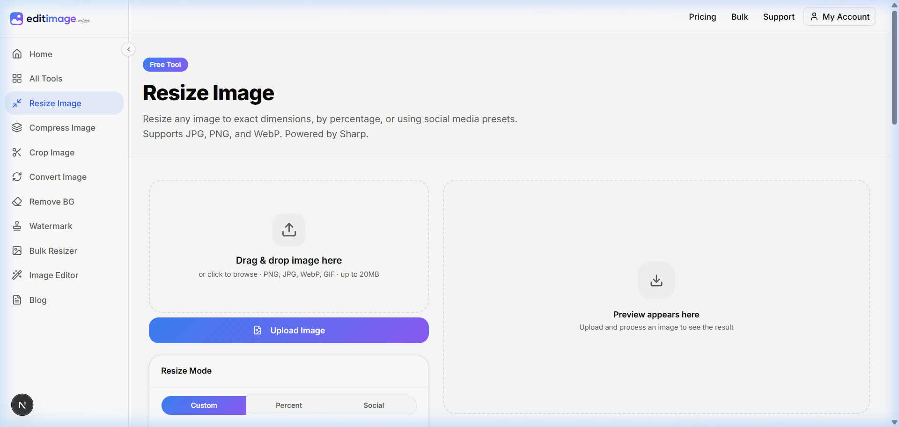
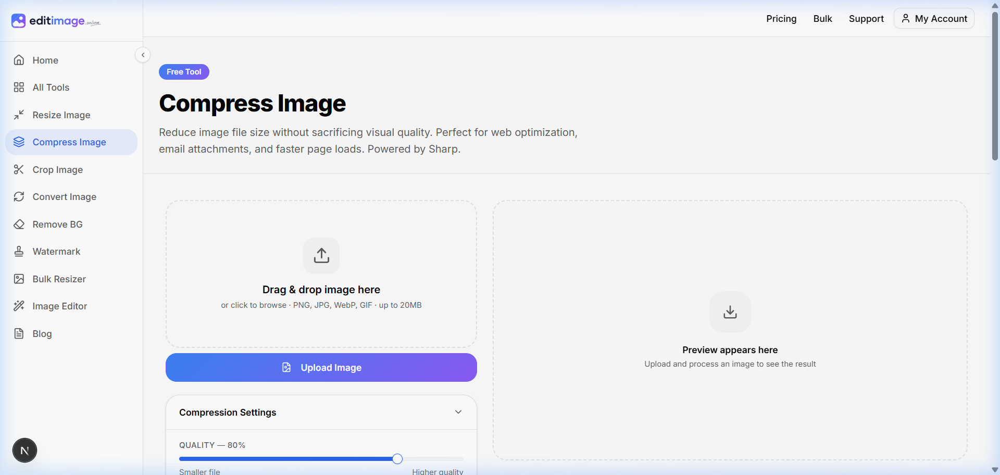
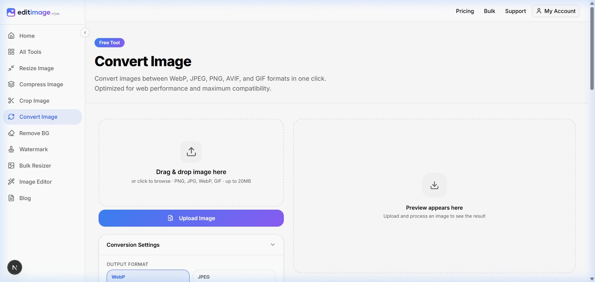
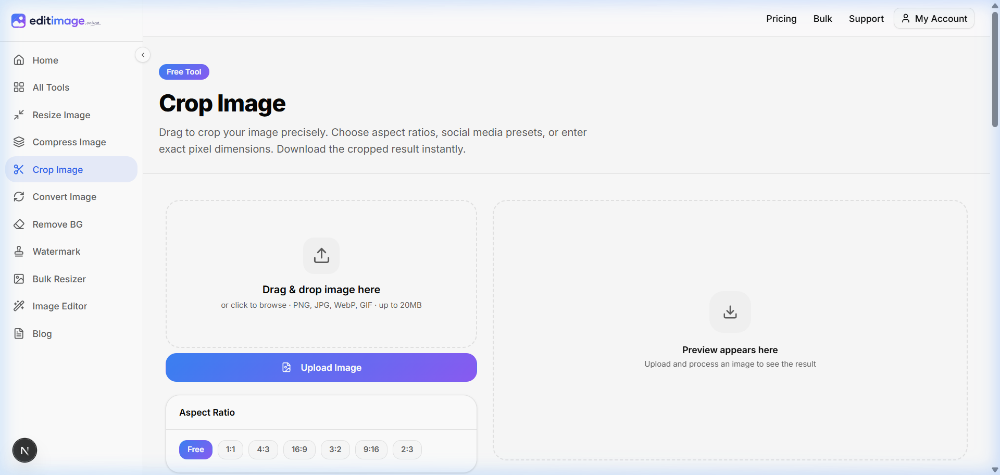
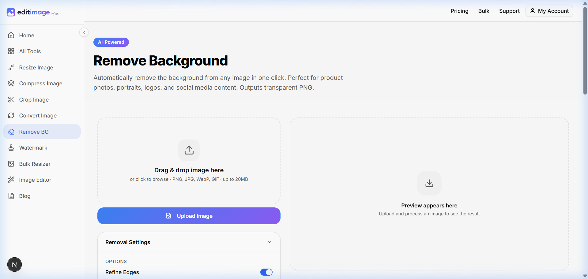
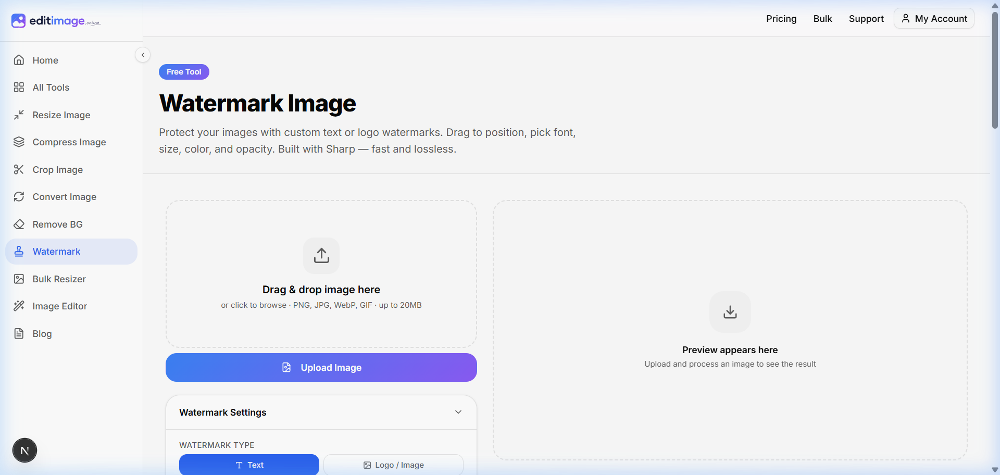
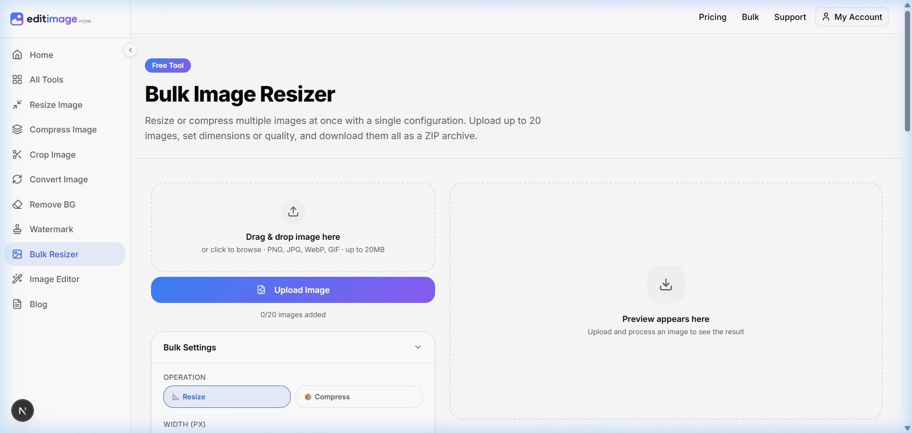
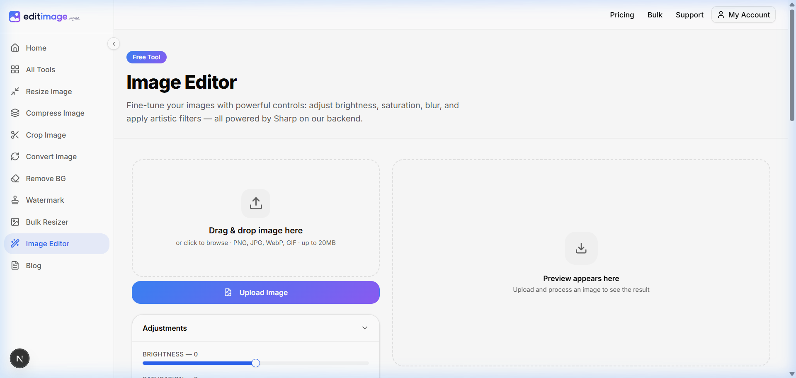

<div align="center">

# 🖼️ editimage.online

### All-in-One Free Image Processing Toolkit

**Resize • Compress • Convert • Crop • Remove Background • Watermark • Edit**

[](https://nextjs.org/)
[](https://react.dev/)
[](https://www.typescriptlang.org/)
[](https://tailwindcss.com/)

</div>

---

## 📖 What is editimage.online?

**editimage.online** is a fast, free, and privacy-first browser-based image toolkit. It lets anyone resize, compress, convert, crop, remove backgrounds, add watermarks, and bulk-process images — **with no account or signup required**.

All processing happens on your server without storing images. Files are auto-deleted after download, keeping your data completely private.

> 🔒 **Privacy-First** · ⚡ **Lightning Fast** · 🆓 **Completely Free** · 🚫 **No Login Required**

---

## 🖥️ Screenshots

### 🏠 Homepage — All-in-One Image Toolkit


The homepage presents all tools with a clean dark-themed layout, animated hero section, star ratings, trust badges, and a step-by-step "How It Works" flow.

---

### 🗂️ All Tools — Browse Every Feature


A dedicated tools page that organizes all available tools into categories: **Quick Adjustments** and **Advanced Editing**, making discovery effortless.

---

## 🛠️ Tools & Features

### 📐 Resize Image


Change image dimensions with precision. Supports three modes:
- **Custom** — set exact pixel width & height
- **Percent** — scale by percentage
- **Social** — pick from preset sizes (Instagram, Twitter, Facebook, etc.)

---

### 🗜️ Compress Image


Reduce file size without sacrificing visual quality. Features:
- Quality slider (0–100%)
- Supports JPEG, PNG, WebP
- Real-time file-size estimation

---

### 🔄 Convert Image


Convert between all major image formats:
- PNG → JPG / WebP / AVIF / GIF
- Preset suggestions (WebP for web, JPEG for universal)
- Lossless & lossy options

---

### ✂️ Crop Image


Crop images to any size or aspect ratio:
- Free-form cropping
- Preset ratios: **1:1**, **4:3**, **16:9**, **3:2**, **9:16**, **2:3**
- Interactive drag-and-crop preview

---

### 🪄 Remove Background


AI-powered background removal in one click:
- Powered by **@imgly/background-removal**
- Refine Edges toggle for clean cut-outs
- Outputs transparent PNG

---

### 💧 Watermark Image


Protect and brand your images:
- **Text watermarks** — custom font, size, color, opacity
- **Logo / Image watermarks** — upload a PNG logo
- Position control (9-grid)

---

### 📦 Bulk Resizer


Process up to **20 images at once**:
- Bulk Resize (pixel or percent)
- Bulk Compress (quality slider)
- Download all as a single ZIP file

---

### 🎨 Image Editor


Fine-tune your photos with real-time adjustments:
- **Brightness** · **Contrast** · **Saturation**
- **Blur** · **Sharpen** · **Hue Rotation**
- Non-destructive sliders with live preview

---

## ⚙️ Tech Stack

| Layer | Technology |
|---|---|
| **Framework** | [Next.js 16](https://nextjs.org/) (App Router) |
| **Language** | TypeScript 5 |
| **UI Library** | React 19 |
| **Styling** | Tailwind CSS v4 |
| **Components** | Shadcn/UI + Radix UI |
| **Animations** | Motion (Framer Motion) |
| **State Management** | Redux Toolkit + Immer |
| **Image Processing** | Sharp (server-side) |
| **Background Removal** | @imgly/background-removal |
| **Crop** | react-image-crop |
| **Bulk ZIP** | JSZip |
| **Icons** | Lucide React |

---

## 🚀 Getting Started

### Prerequisites
- **Node.js** v18 or higher
- **npm** / **yarn** / **pnpm**

### Installation

```bash
# 1. Clone the repository
git clone https://github.com/YOUR_USERNAME/editimage.git
cd editimage

# 2. Install dependencies
npm install

# 3. Start the development server
npm run dev
```

Open [http://localhost:3000](http://localhost:3000) in your browser.

### Build for Production

```bash
npm run build
npm start
```

---

## 📁 Project Structure

```
editimage/
├── app/                        # Next.js App Router
│   ├── page.tsx                # Homepage
│   ├── layout.tsx              # Root layout (sidebar, header, footer)
│   ├── globals.css             # Global styles & CSS variables
│   ├── resize-image/           # Resize tool page
│   ├── compress-image/         # Compress tool page
│   ├── convert-image/          # Convert tool page
│   ├── crop-image/             # Crop tool page
│   ├── remove-background/      # AI background removal page
│   ├── watermark-image/        # Watermark tool page
│   ├── bulk-resizer/           # Bulk processing page
│   ├── image-editor/           # Image editor page
│   ├── tools/                  # All tools listing page
│   ├── blog/                   # Blog section
│   └── api/                    # API routes (server-side processing)
│       ├── resize/             # Resize API
│       ├── compress/           # Compress API
│       ├── convert/            # Convert API
│       ├── crop/               # Crop API
│       ├── remove-bg/          # Background removal API
│       ├── watermark/          # Watermark API
│       ├── bulk/               # Bulk processing API
│       ├── edit/               # Image edit API
│       ├── upload/             # File upload handler
│       └── cleanup/            # Cleanup temp files
│
├── components/                 # Reusable React components
│   ├── AppSidebar.tsx          # Left navigation sidebar
│   ├── TopHeader.tsx           # Top navigation bar
│   ├── Footer.tsx              # Page footer
│   ├── HeroAnimation.tsx       # Animated hero canvas
│   ├── ToolCard.tsx            # Tool grid card
│   ├── UploadDropzone.tsx      # Drag-and-drop upload zone
│   ├── ToolPageTemplate.tsx    # Shared tool page layout
│   ├── BeforeAfterCompare.tsx  # Before/after image slider
│   ├── FAQAccordion.tsx        # FAQ accordion section
│   └── ui/                     # Shadcn UI primitives
│
├── src/
│   ├── server/                 # Server-side utilities
│   └── shared/                 # Shared types & helpers
│
├── lib/                        # Utility functions
├── hooks/                      # Custom React hooks
├── public/                     # Static assets & screenshots
├── next.config.ts              # Next.js configuration
├── tailwind.config.ts          # Tailwind CSS configuration
└── tsconfig.json               # TypeScript configuration
```

---

## 🌊 How It Works

```
1. Upload Image   →   Drag & drop or click to select (up to 20MB)
       ↓
2. Choose a Tool  →   Pick from Resize, Compress, Convert, Crop, etc.
       ↓
3. Configure      →   Set dimensions, quality, format, watermark text, etc.
       ↓
4. Process        →   Sent to Next.js API route → processed by Sharp / AI
       ↓
5. Download       →   Get your image instantly. File auto-deleted after.
```

---

## 🔒 Privacy & Security

- ✅ Images are **never stored permanently** — auto-deleted after download
- ✅ No user accounts or tracking
- ✅ All transfers happen over **HTTPS / SSL**
- ✅ Background removal runs **client-side** (no upload needed for that tool)
- ✅ Server-side processing via Sharp for other tools (fast & secure)

---

## 📋 Available Scripts

| Command | Description |
|---|---|
| `npm run dev` | Start development server at localhost:3000 |
| `npm run build` | Build the production bundle |
| `npm start` | Start the production server |
| `npm run lint` | Run ESLint checks |

---

## 🤝 Contributing

Contributions are welcome! Feel free to:
1. Fork the repo
2. Create a feature branch (`git checkout -b feature/new-tool`)
3. Commit your changes (`git commit -m 'Add new tool'`)
4. Push to the branch (`git push origin feature/new-tool`)
5. Open a Pull Request

---

## 📄 License

This project is licensed under the **MIT License** — see the [LICENSE](LICENSE) file for details.

---

<div align="center">

Made with ❤️ — **editimage.online**

⭐ Star this repo if you find it useful!

</div>
